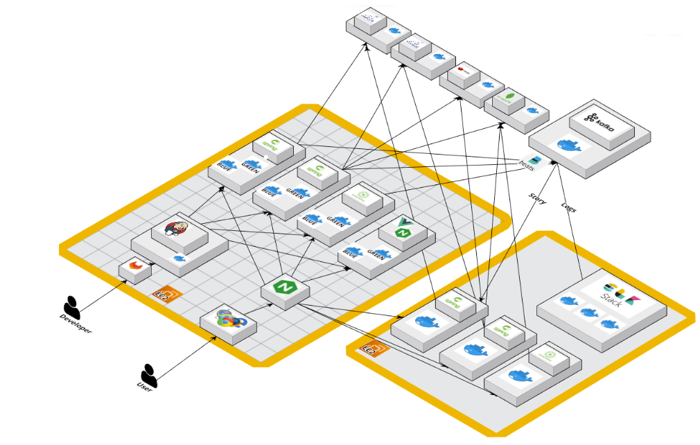
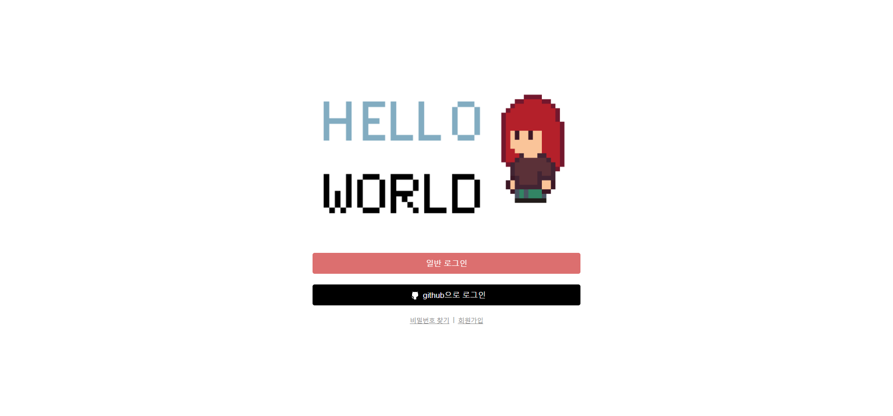
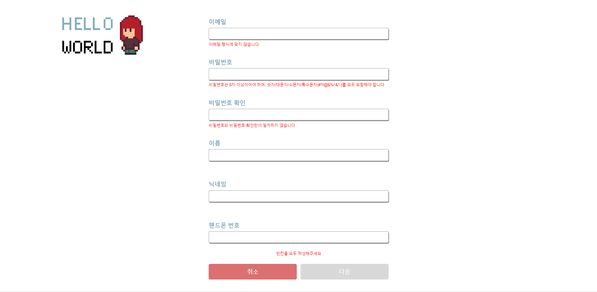
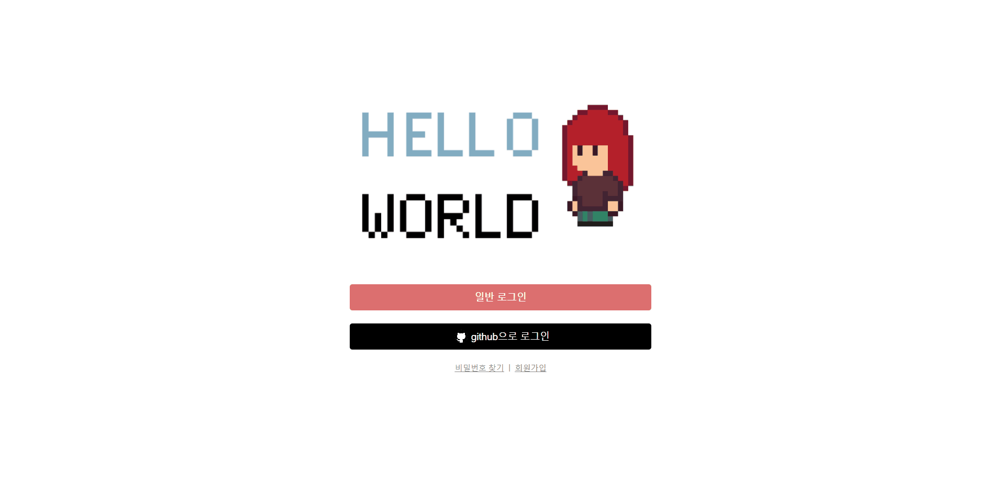
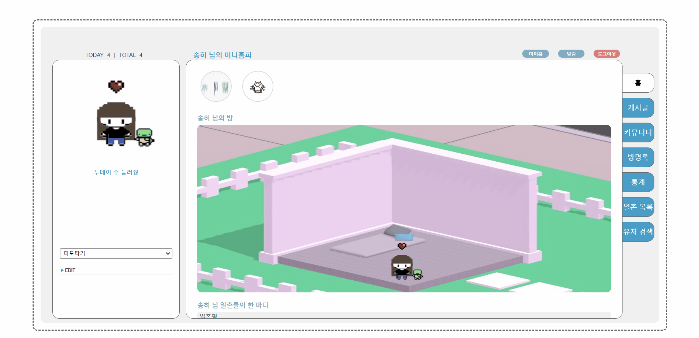
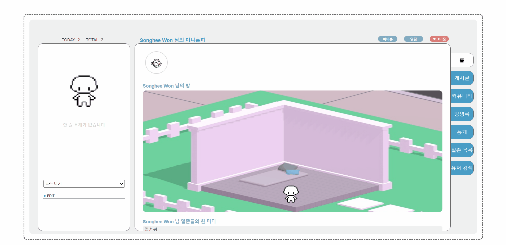
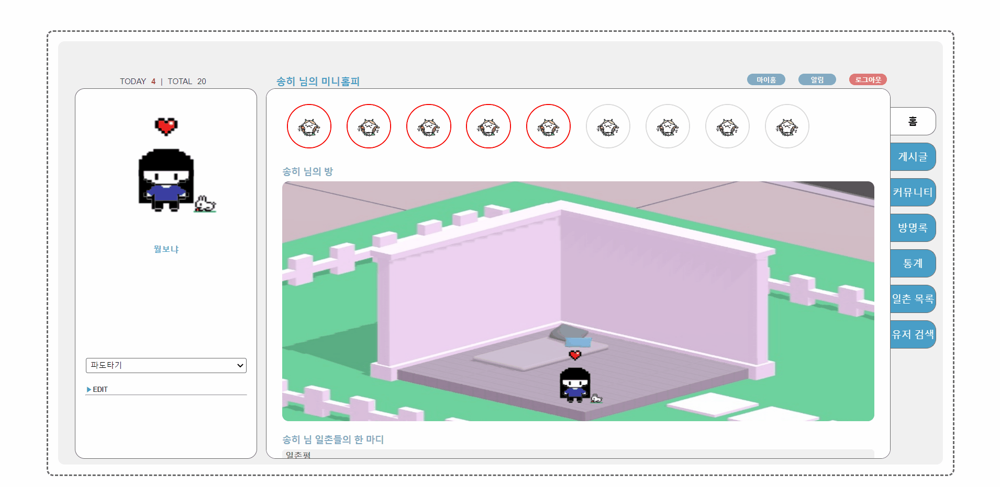
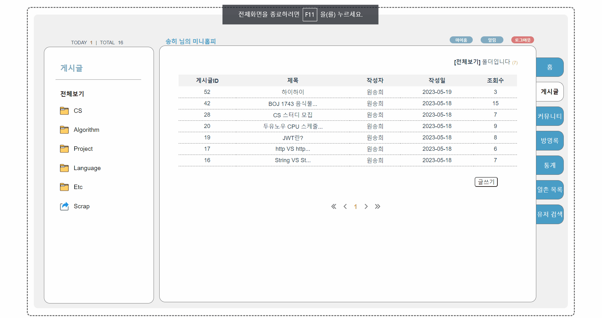
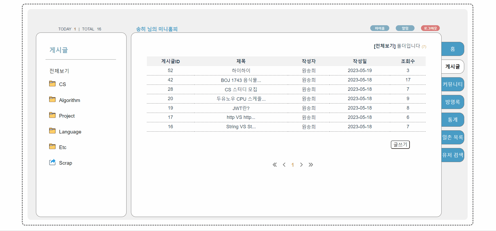
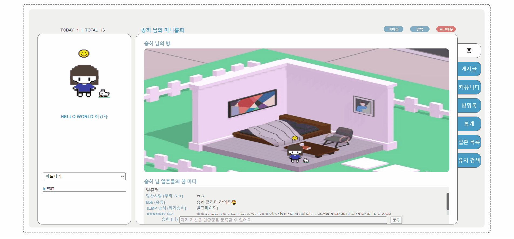

# 🙋🏻‍♀️🙋🏻‍♂️HelloWorld - 개발자 커뮤니티 서비스

### 🕑프로젝트 기간

2023.4.10 ~ 2023.5.19

### 💡등장 배경

Github, Tistory 같은 서비스를 이용하며 뭔가 허전한 점, 이런 점이 아쉽다는 생각 해보신 적 없으신가요?

Github는 시각적인 요소는 제공하지만 가독성이 떨어지고, Tistory는 가독성은 좋지만 시각적인 요소가 부족하고 두 서비스 모두 재미를 느낄 수 없어 꾸준히 이용하기 어렵습니다.

### 오락적 요소와 개발 지식, 두 마리의 토끼를 모두 잡을 수 있도록 Hello World가 도와드리겠습니다!

### 🤔개요

HelloWorld는 Github와 SNS 각각의 장점을 가져온 개발자 커뮤니티 서비스입니다.

자신의 개발 내역이나 배운 지식을 MarkDown 문법으로 기록해둘 수 있을 뿐만 아니라, 이를 사람들과 공유할 수 있게 해줍니다.

이로써 개발자들로 하여금 수월하게 프로젝트나 지식을 공유할 수 있도록 도와주고, SNS 식 재밌는 오락 요소도 느껴 개발에 보다 흥미를 가질 수 있게 도와줍니다.

또, github의 잔디 심기와 같은 기능이나 통계 페이지를 통해 자신의 활동량을 한 눈에 볼 수 있도록 도와줍니다.

### 🛠주요 기능

### 미니홈피

- 투데이 수, 좋아요 수에 따른 미니룸 변경
- 내가 작성한 게시글에 대한 정보 (언제, 몇 개를 작성했는지) 잔디로 조회 및 해당 게시글로 이동 가능
- 일촌의 경우, 일촌평 조회 및 작성 가능
- 스토리 조회 및 해당 게시글로 이동 가능

### 게시글

- 카테고리 별 게시글 작성 / 조회 / 수정 / 삭제 가능
- 게시글마다 댓글 가능
- 게시글마다 스티커 가능 (좋아요, 도움됐어요, 이해가 쏙쏙 돼요 총 3개의 스티커 존재)
- 게시글 스크랩 기능 (내 홈페이지에 게시 가능)

### 커뮤니티

- 실시간 인기 검색어 1~10위 확인 가능
- 모든 유저가 작성한 게시글을 최신순으로 무한 스크롤 형태로 제공
- 게시글 검색 가능 (제목+내용 검색)

### 스토리

- 일촌이 게시글 작성 시, 자신의 스토리에서 해당 게시글이 작성되었다는 정보를 24시간 동안 조회 가능
- 스토리 클릭 시 해당 게시글로 이동 가능

### 알림

- 일촌이 내 일촌평에 글을 작성했을 때, 어떤 사람이 내 방명록에 글을 작성했을 때, 내 게시물에 댓글이 작성되었을 때, 나에게 일촌 요청이 도착했을 때, 내가 일촌 요청을 보낸 상대가 일촌을 수락했을 때, 총 5가지의 경우에 알림 도착

### 일촌

- 일촌 요청 가능 / 일촌 수락 가능 / 일촌 삭제 가능
- 서로의 일촌명을 지정하여 일촌 요청 가능

### 통계

- 카테고리 별 내가 작성한 글의 정보를 파이차트로 조회 가능
- 주간 TODAY 수 조회 가능
- 업적 및 업적 달성 여부 조회 가능

### 방명록

- 방명록 작성 / 조회 / 수정 / 삭제 가능
- 비밀글로 변경 가능 (비밀글은 해당 홈페이지의 주인과 작성자만 조회 가능)
- 방명록마다 댓글 작성 가능

### 기타

- TODAY, TOTAL 조회 가능
- User별 아바타 디자인 가능
- 소셜로그인 (Github 로그인) 가능
- 파도타기 기능 (추천 유저 조회 및 해당 유저의 홈페이지로 이동 가능)
- 유저 검색 기능 (이메일, 이름, 닉네임으로 검색 가능)
- 일촌 목록 조회 기능
- 이메일 인증 이후 임시 비밀번호 발급 가능
- 유저 홈페이지 별 BGM 재생 기능

### ⚙개발 환경 및 기술 스택

**OS**

- Window 10

**Backend - spring**

- JDK: 11
- Spring Boot: 2.7.10
- Gradle
- Spring Security
- Spring Data JPA
- Spring Data Elasticsearch
- Spring Cloud AWS: 2.2.6.RELEASE
- Spring Boot Starter Oauth2 Client
- Spring Boot Starter Validation
- Springfox Swagger UI: 3.0.0
- Json Web Token(jwt): 0.11.2
- Spring Boot Starter Data Redis
- Spring Kafka
- Spring Boot Starter Mail
- Nurigo SDK: 4.2.7 (SMS 인증)
- Lombok
- Spring Boot Devtools
- MariaDB Java Client
- Spring Boot Starter Test
- Spring Security Test
- Spring Data Redis
- Jedis (Redis client library)
- Spring Boot Starter AOP

**Frontend**

- Vue.js 3
- npm 9.6.4
- Node 18.12.1
- JavaScript
- CSS

**CI/CD**

- Jenkins
- Docker
- Nginx
- gitlab

**IDE**

- IntelliJ
- VS Code

**Database**

- DBMS: Mariadb 10.11.2
- NoSQL: Mongodb 4.4
- Cache: Redis 7.0.11
- SearchEngine: ElasticSearch 7.10.1

**Server**

- AWS EC2
- Ubuntu 20.04 LTS (GNU/Linux 5.4.0-1018-aws x86_64) 2
- AWS S3
- CertBot

### 🎨시스템 아키텍처



### 💾프로젝트 파일 구조

- Backend

```
back
└─ src
   └─ main
      ├─ java
      │  └─ com
      │     └─ project
      │        └─ helloworld
      │           ├─ aoplog
      │           ├─ config
      │           ├─ controller
      │           ├─ domain
      │           ├─ dto
      │           │  ├─ request
      │           │  └─ response
      │           ├─ elkStack
      │           │  └─ domain
      │           ├─ exception
      │           ├─ interceptor
      │           ├─ repository
      │           ├─ schedule
      │           ├─ security
      │           │  ├─ jwt
      │           │  └─ oauth2
      │           └─ service
      └─ resources
```

- Frontend

```bash
FE
├─ src
│  ├─ api
│  ├─ assets
│  │  ├─ chatbot
│  │  ├─ icon
│  │  ├─ image
│  │  │  ├─ achievement
│  │  │  ├─ emotion
│  │  │  ├─ hair
│  │  │  ├─ pants
│  │  │  ├─ pet
│  │  │  └─ shirt
│  │  └─ minimi_temp
│  ├─ components
│  │  ├─ BasicComp
│  │  ├─ BoardComp
│  │  │  └─ CommentComp
│  │  ├─ FollowComp
│  │  ├─ GuestBookComp
│  │  ├─ MainPageComp
│  │  ├─ NotifyComp
│  │  ├─ StatisticComp
│  │  └─ UserComp
│  ├─ router
│  └─ views
│     ├─ BoardView
│     └─ UserView
│        ├─ findpw
│        ├─ login
│        ├─ modify
└────────└─ register
```

### 👨🏻‍🤝‍👨🏻협업 툴

- Notion
- Jira
- Git
- Webex
- MatterMost

### 👨🏻‍🤝‍👨🏻협업 환경

- Gitlab
  - 코드의 버전 관리
  - MR시, 팀원이 코드 리뷰를 진행하고 피드백 게시
- JIRA
  - 매주 목표량을 설정하여 Sprint 진행
  - 업무의 할당량을 정하여 Story Point를 설정하고, In-Progress -> Done 순으로 작업
- Notion
  - 회의가 있을때마다 회의록을 기록하여 보관
  - 기술 확보 시, 다른 팀원들도 추후 따라할 수 있도록 보기 쉽게 작업 순서대로 정리
  - 컨벤션 정리
  - 간트차트 활용한 개발 계획 관리
  - 스토리 보드, 시퀀스 다이어그램, 기능 명세서 등 팀원 모두가 공유해야 하는 문서 관리

### 😎팀원 역할

- 조현동
  - 팀장
  - Backend
- 변유정
  - UI/UX 디자인
  - Frontend
- 배정현
  - CI/CD
  - Backend
- 원송희
  - UI/UX 디자인
  - Frontend
- 안영훈
  - Backend
- 서주광
  - Backend

### 🎞기능 소개 및 화면

### 로그인 이전



- 일반 로그인, github로그인, 회원가입 등을 선택할 수 있는 화면

### 회원가입 및 아바타 생성



- 회원가입에 필요한 유저 정보 모두 기입 후, 아바타 디자인 가능

### 일반 로그인



- 회원가입한 아이디, 비밀번호로 로그인

### 소셜 로그인


- github 계정으로 로그인

### 회원 정보 수정



- 회원가입 시 입력한 정보를 수정(이메일은 수정 불가) 하거나 확인 가능

### 회원 아바타 수정



- 회원가입 시 생성한 아바타를 수정하거나, github로그인 시 기본 아바타가 제공되는데 이를 수정 가능

### 메인 페이지



- 해당 홈페이지 주인의 아바타, 닉네임, 잔디, 일촌평, 미니룸 등을 확인 가능
- 로그인된 사용자의 스토리 확인 가능

### 메인 세부 - 스토리


- 로그인된 사용자와 일촌인 다른 사용자가 게시글을 작성하게 되면, 해당 시간으로부터 24시간 동안 게시글이 노출됨

### 메인 세부 - 파도타기


- 랜덤으로 추천되는 사용자의 페이지로 이동 가능

### 메인 세부 - 잔디


- 글을 많이 작성하면 작성할 수록 잔디의 색깔이 진해짐
- 잔디를 눌러 그 날 작성한 게시글을 확인할 수 있고, 제목 클릭 시 해당 게시글로 이동 가능

### 메인 세부 - 일촌평


- 홈페이지 주인과 일촌인 사람만이 일촌평을 작성 가능

### 게시글 조회



- 카테고리 별 게시글 조회 및 전체 게시글 조회 가능

### 게시글 작성



- 마크다운 형식으로 게시글 작성 가능

### Scrap



- 모든 유저들이 작성한 게시글 scrap 가능
- scrap한 게시글은 scrap 페이지 에서 조회 및 삭제 가능

### 커뮤니티


- 실시간 인기 검색어 10위를 확인 가능
- 검색 이전에는 다른 사용자들이 작성한 모든 글들을 최신순으로 조회 가능
- 검색 이후에는 해당 검색어와 연관 있는 글들을 조회 가능

### 방명록


- 누구나 작성 가능 (홈페이지 주인 제외)
- 공개글/비밀글 설정 가능
- 방명록에 대한 댓글은 홈페이지 주인만이 게시 가능

### 통계


- 주간 투데이 수, 포스팅한 게시글의 카테고리 별 퍼센트, 업적(좋아요 개수, 투데이 수, 포스팅 개수 등에 따라 달성 가능) 을 확인 가능

### 일촌 목록


- 현재 홈페이지의 주인과 일촌인 사용자들의 목록을 조회 가능

### 유저 검색


- 사용자를 검색 가능
- 이메일, 닉네임, 이름 중 필터링을 선택하여 검색 가능

### 알림


- 일촌 요청이 오거나, 일촌 수락이 되거나, 내 게시물에 누가 댓글을 달거나, 내 방명록에 누가 글을 남기면 알림 도착
- 댓글이나 방명록 관련 알림의 경우 클릭 시 해당 게시글이나 방명록으로 이동 가능
- 읽기 전과 읽기 후의 색이 다르게 노출
